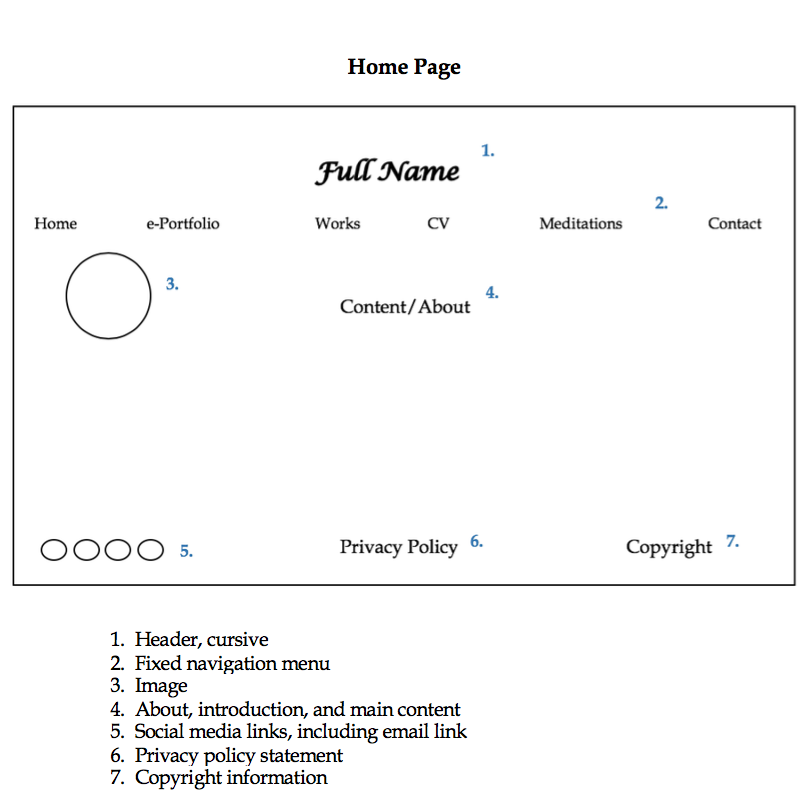
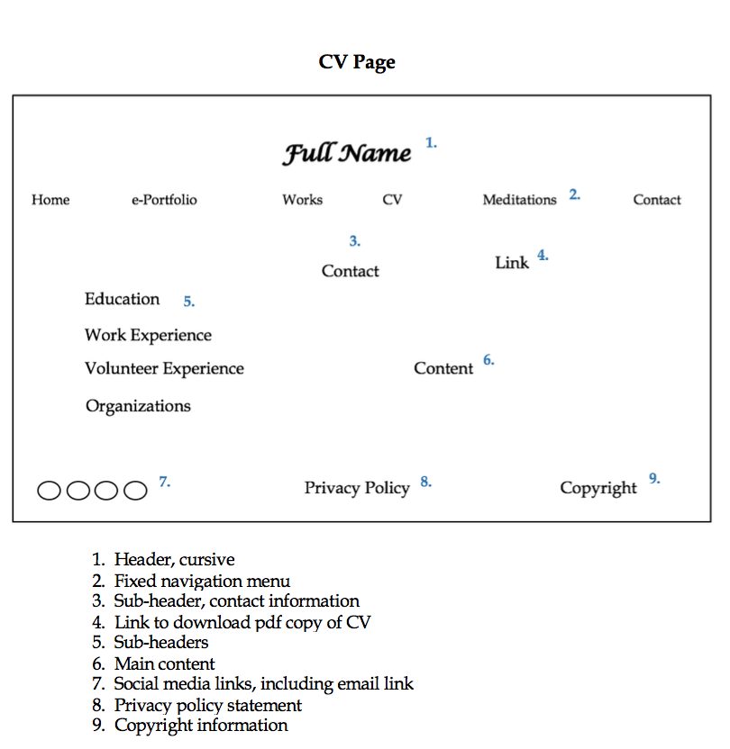
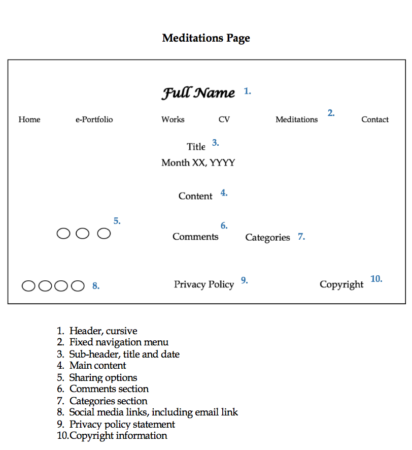

# INF 7420 Project - Wireframe
For my project, I am going to create a professional website that will include my e-Portfolio. I was planning on creating one anyone, once I graduated, but this way I get to create something that will also be included in my e-Portfolio.
## Wireframes
I have included wireframes for my home, meditations, and CV pages.
### **Home Page**

*Header*: will include my name in a cursive font and a fixed navigation menu.
*Navigation Menu*: includes links to the main pages- home, e-Porfolio, works, CV, meditations, and contact information.
*Main Content*: will include a brief but thorough "about me" section and a small image to the left.
*Footer*: will include links to social media, privacy policy and copyright information.
### **CV Page**

*Header*: will include my name in a cursive font and a fixed navigation menu.
*Navigation Menu*: includes links to the main pages- home, e-Porfolio, works, CV, meditations, and contact information.
*Main Content*: will include linked contact information, a link to download a pdf copy of my CV, and a standard CV outline with each section having a sub-header.
*Footer*: will include links to social media, privacy policy and copyright information.
### **Meditations Page**

*Header*: will include my name in a cursive font and a fixed navigation menu.
*Navigation Menu*: includes links to the main pages- home, e-Porfolio, works, CV, meditations, and contact information.
*Main Content*: willl include title of the posting, date and main content. The end of the posting will include links to share via different social networking sites, a comments section, and a linked categories section.
*Footer*: will include links to social media, privacy policy and copyright information.